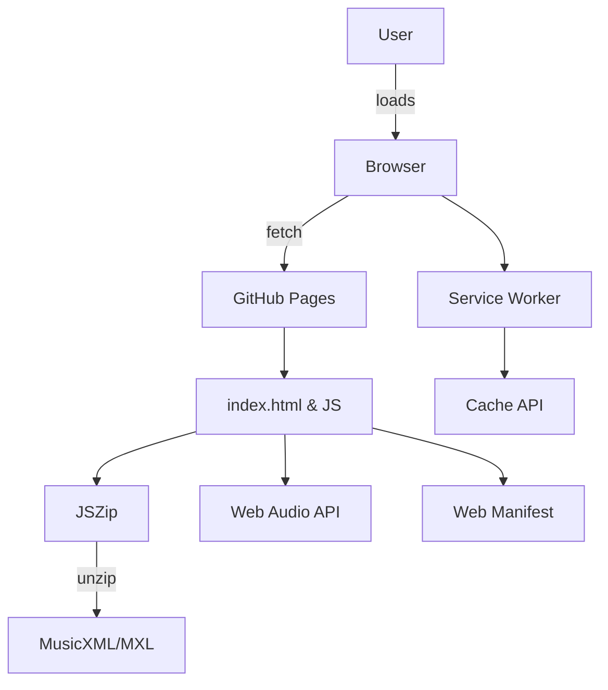

[try me](http://www.bryandebourbon.com/eMusicReader/)

## Development preview

To preview the `index.html` file from any branch on GitHub, you can use
[HTMLPreview](https://htmlpreview.github.io/) by substituting your repository
URL and branch name:

```
https://htmlpreview.github.io/?https://raw.githubusercontent.com/<USER>/<REPO>/
```

Replace `<USER>`, `<REPO>` with the appropriate values to get a
clickable link for testing a pull request.

## Importing Scores

Drag and drop a `.musicxml` or `.mxl` file onto the page or select it with the
file picker. `.mxl` files are zipped archives—JSZip is bundled locally as
`jszip.min.js` to unzip them in the browser.

## Touch Support

You can swipe across the staffs on mobile devices to select a phrase. When you lift your finger, all matching phrases in the score will be highlighted.


## Page Navigation

Scrolling is disabled so swipe gestures work reliably. Use the new left and right arrows to move between pages. Each page spans exactly one screen height.

## Progressive Web App

This site now includes a web manifest and service worker so it can be installed on mobile and desktop browsers. Add it to your home screen to use it like a native app.

## iPhone Support

The Web Audio API used for playback is compatible with Safari on iOS. Tap the play button to start audio—the app will resume the underlying `AudioContext` if it is suspended. Add the site to your home screen to install it as a Progressive Web App on iPhone.

## AI Mode

Use the brain dropdown to select a ChatGPT mode. Choices include **Technical** analysis, **Fingering** advice, **Sheet Music** generation, or turning the AI **Off**. The icon changes color based on the selected personality. AI is off by default so you'll only be asked for an OpenAI API key when enabling one of the modes.

- When "Fingering" is enabled, any selected passage is sent to ChatGPT and the returned fingering numbers appear above the notes.
- When "Technical" is enabled, selected passages are analyzed for musical insights and theory.
- When "Sheet Music" is enabled, a simple interface appears where you can enter a song name (e.g., "Twinkle Twinkle Little Star", "Ode to Joy"). The AI generates MusicXML for the song and automatically loads it into the app.

## Architecture

The app is a static site that runs entirely in the browser. A service worker caches
the core assets so it works offline, and a web manifest makes it installable as a
Progressive Web App.


